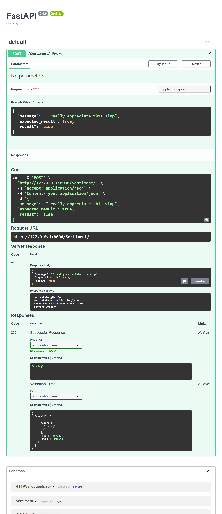

# Sentiment Analysis API

## Overview

A simple sentiment analysis project that predicts whether a given text is positive or negative.

- Trained using Python and scikit-learn

- Uses a Naive Bayes model with pipelines for preprocessing and prediction

- Exposed via a FastAPI backend for programmatic access

## Tech Stack

- Python – core language

- scikit-learn – model training and pipelines

- FastAPI – REST API backend

- Joblib – model serialization

## Features

- Predict sentiment of text input (positive/negative)

- Modular pipeline for preprocessing and model inference

- Simple API endpoint to integrate with other applications

# Getting Started

1. Clone the Repository

```bash
git clone https://github.com/Poorna-Raj/simple-sentiment-analysis-model.git
cd sentiment-analysis
```

2. Install Dependencies

```bash
pip install -r requirements.txt
```

3. Get the dataset and move to `data` folder

```bash
https://www.kaggle.com/datasets/lakshmi25npathi/imdb-dataset-of-50k-movie-reviews
```

4. Run the API

```bash
cd app
fastapi dev main.py
```

## Api Usage

1. Visit the Api documentation(Swagger)

```bash
http://127.0.0.1:8000/docs
```



# Model Details

- Algorithm: Multinomial Naive Bayes

- Preprocessing: Tokenization, vectorization using CountVectorizer, handled via scikit-learn pipeline

- Accuracy: ~86% on test set
